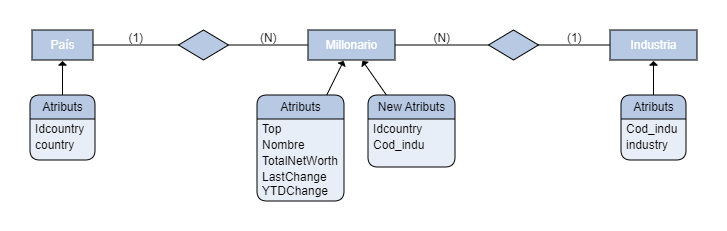

# *Informe del proyecto BD*
### *Las 500 personas más ricas del 2021*

## **Descripción del contenido del fichero**
El fichero está basado en el índice de multimillonarios de Bloomberg, el cual es una
clasificación trimestral de las personas más ricas del mundo.
El fichero indica entre un rango del 01-500 las personas más ricas, su fortuna y las
variaciones de esta, como país y oficio. La riqueza personal se basa en los cambios de
mercado, la economía y los informes de Bloomberg, que se esfuerzan en calcular el
patrimonio neto individual de cada multimillonario.
### Contenido de las columnas:
* **Rango:** Es un número entero que posiciona a cada multimillonario según su riqueza, como es habitual, los números más próximos a cero (uno, dos, tres, ...) son los líderes del ranking.
* **Nombre:** En esta columna se incluyen el nombre y apellidos por el que se reconoce a la persona, también se incluyen en algunas de ellas a las familias como parte del índice o ranking.
* **Total Net Worth:** Es valor neto total de la riqueza de cada multimillonario, incluye un carácter “$” al principio de cada valor, seguido del índice de riqueza en numérico y finalizado en un carácter “B” referente a Billion dollars (mil millones).
* **Last Change:** Es la cantidad que ha variado la riqueza de cada multimillonario respecto al trimestre anterior calculado. Esta columna inicia con un carácter “+” o “-” indicando si la riqueza ha aumentado o disminuido, también, incluye un carácter “$”, seguido del índice de riqueza en numérico y finalizado en un carácter “B” o “M” haciendo referencia a Billion o Million dollars.
* **YTD Change:** Es la cantidad que ha variado la riqueza de cada multimillonario, en el periodo de tiempo que comienza el primer día del año calendario actual o año fiscal hasta la fecha actual. Como en la columna anterior, inicia con un carácter “+” o “-” indicando si la riqueza ha aumentado o disminuido, también, incluye un carácter “$”, seguido del índice de riqueza en numérico y finalizado en un carácter “B” o “M” haciendo referencia a Billion o Million dollars.
* **Country:** En esta columna se indica el país de origen de cada multimillonario.
* **Industry:** En esta columna se indica la industria donde el multimillonario genera su riqueza.
## **Normalización de la base de datos**
### DER

La normalización de la base de datos se ha hecho según el DER, creando a partir del Script principal 3 tablas nuevas:
### Tabla País
La tabla de country se ha creado una variable "idcountry" que es un int autonumerico como identificador del país, y una variable varchar para contener el nombre del país.
```sql
drop table if exists pais;
create table pais (idcountry int auto_increment, country varchar(20), primary key (idcountry));
insert into pais
select distinct null as idcountry, country from dades_raes group by country;
```
### Tabla Industria
Al igual que en tabla anterior, se crea una variable "cod_indu" int autonumerica como identificador de la industria, y una variable varchar para contener el nombre de la industria.
```sql
drop table if exists industria;
create table industria (cod_indu int auto_increment, industry varchar(20), primary key(cod_indu));
insert into industria
select distinct null as cod_indu, industry from dades_raes;
```
### Tabla Milionari
En esta tabla hacemos una copia de la tabla original del proyecto "Dades_raes", en la que cargamos todos los datos y añadimos las nuevas variables identificatorias de las tablas país e industria. Posteriormente, cargamos los identificadores y eliminamos las columnas de "country" e "industry".
```sql
drop table if exists Milionari;
create table Milionari select * from dades_raes;

alter table Milionari add column idcountry int;
alter table Milionari add column cod_indu int;
update Milionari as m1 set idcountry = (select idcountry from pais as p1 where m1.country=p1.country);
update Milionari as m2 set cod_indu = (select cod_indu from industria as i1 where m2.industry=i1.industry);
alter table milionari drop column country;
alter table milionari drop column industry;
```
### Modificacion de TotalNetWorth
Para un mejor uso de la base de datos modificamos la columna "TotalNetWorth" eliminando los caracteres "$" y "B", como también transformándola en un double y multiplicando por 10e9 que es el equivalente a 1 Billion Dollars.
```sql
update Milionari set TotalNetWorth = replace(TotalNetWorth, '$', "");
update Milionari set TotalNetWorth = replace(TotalNetWorth,'B', "");
alter table Milionari modify column TotalNetWorth double;
update Milionari set TotalNetWorth = TotalNetWorth*1000000000;
```
### Foreing Keys
Para finalizar incluimos las foreing keys a la tabla de Milionari referenciando a las de país e industria.